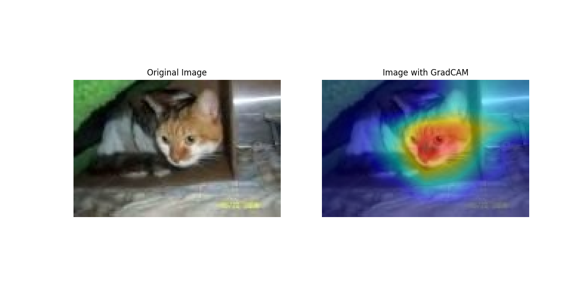
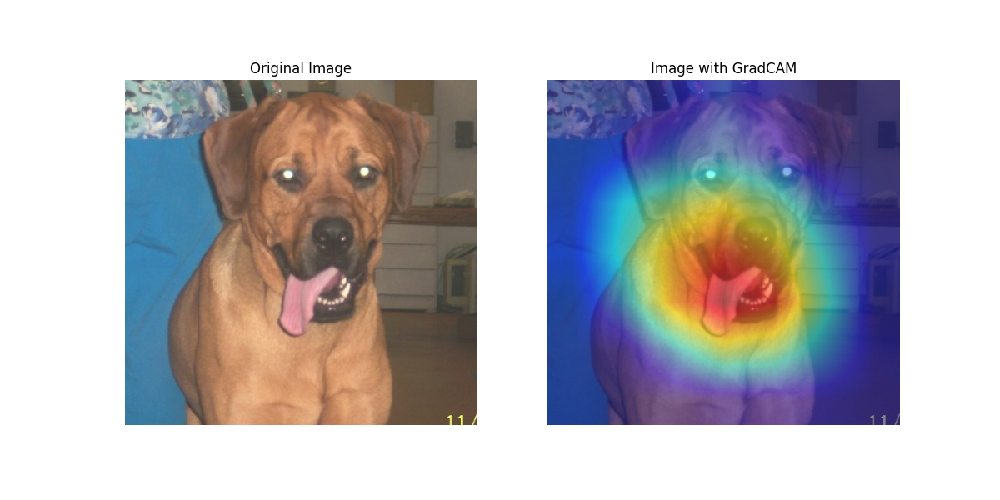
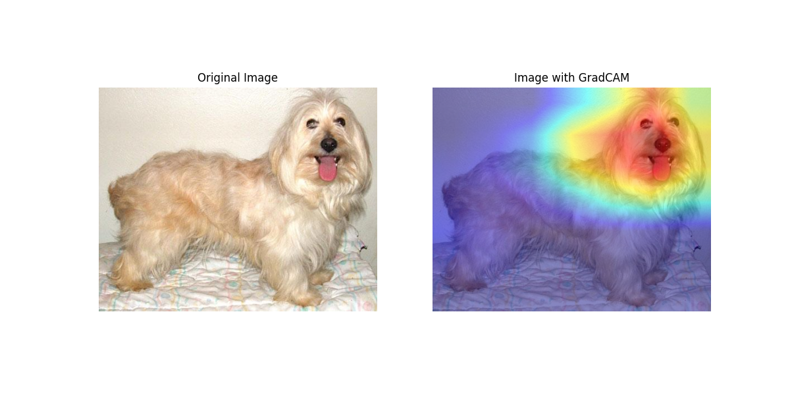
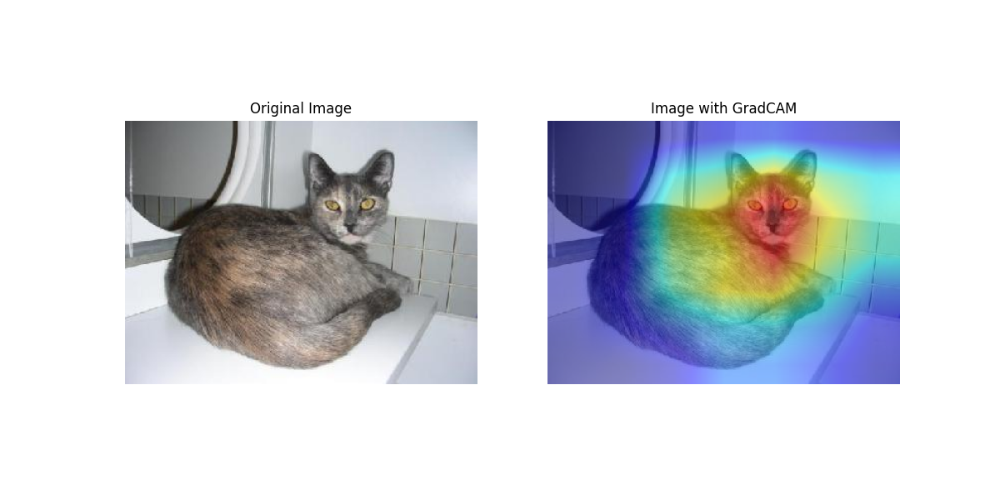

# GradCAM Implementation for Machine Learning Models

This repository contains the Python code for applying Gradient-weighted Class Activation Mapping (GradCAM) to visualize the areas of input images that are important for predictions by a convolutional neural network model, specifically trained for differentiating between dogs and cats.

## Dataset

The model is trained on the [Kaggle Cat vs. Dog dataset](https://www.kaggle.com/datasets/karakaggle/kaggle-cat-vs-dog-dataset), which is a popular dataset used in binary classification tasks for computer vision.

## Contents

- `train.ipynb` : Notebook where the model is trained
- `gradcam.ipynb` : Notebook where gradcam is implemented from scratch
  
## Results

Below are some example outputs from the GradCAM implementation, showcasing the regions of interest that the model focuses on when predicting between a cat and a dog:

## Blog

For a detailed explanation of how GradCAM works and how it was implemented for this specific classification task, refer to our blog post. The link to the blog will be updated here soon.
